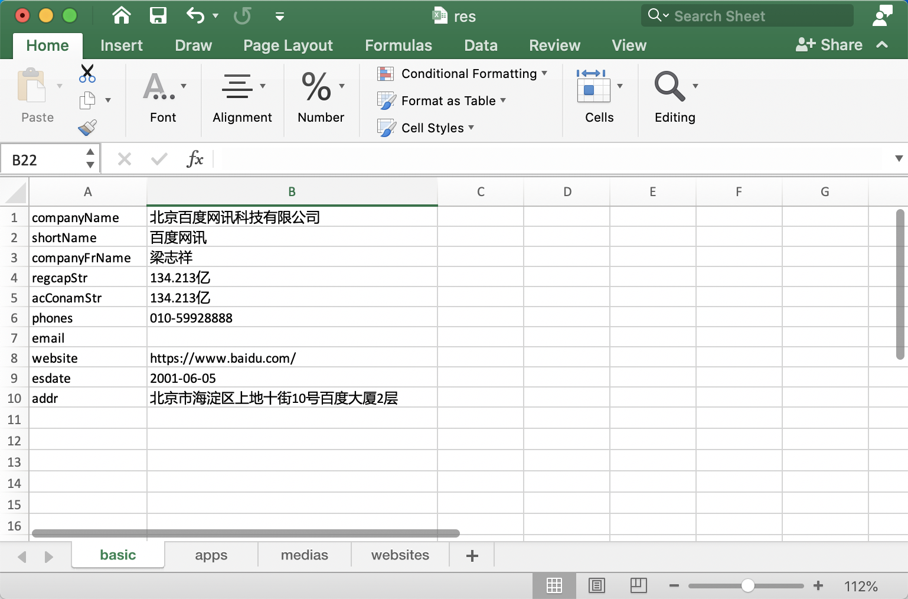
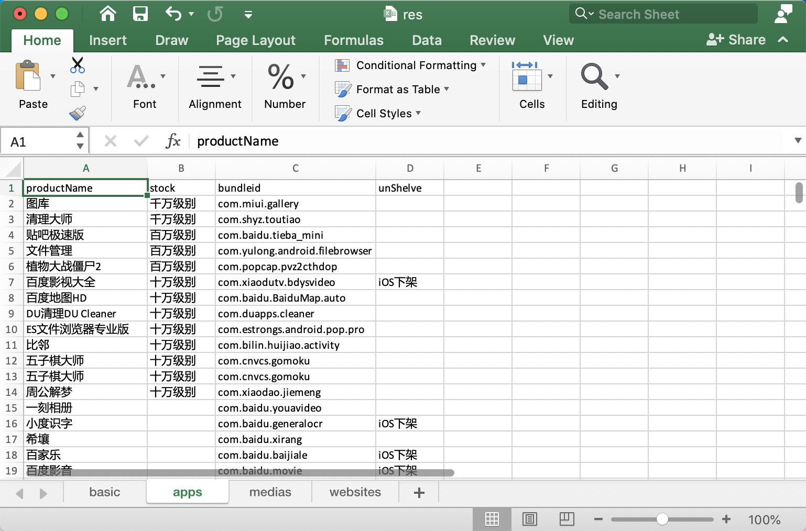
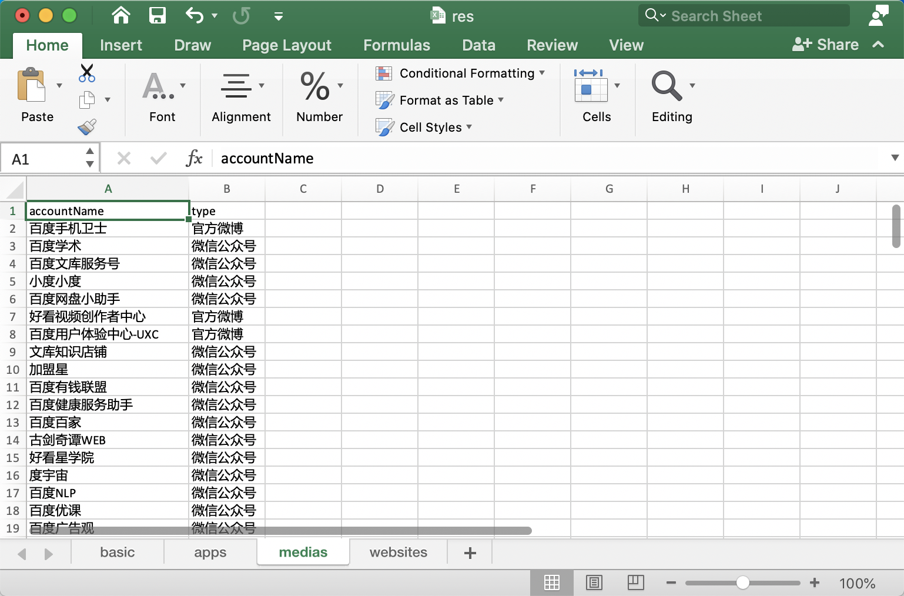
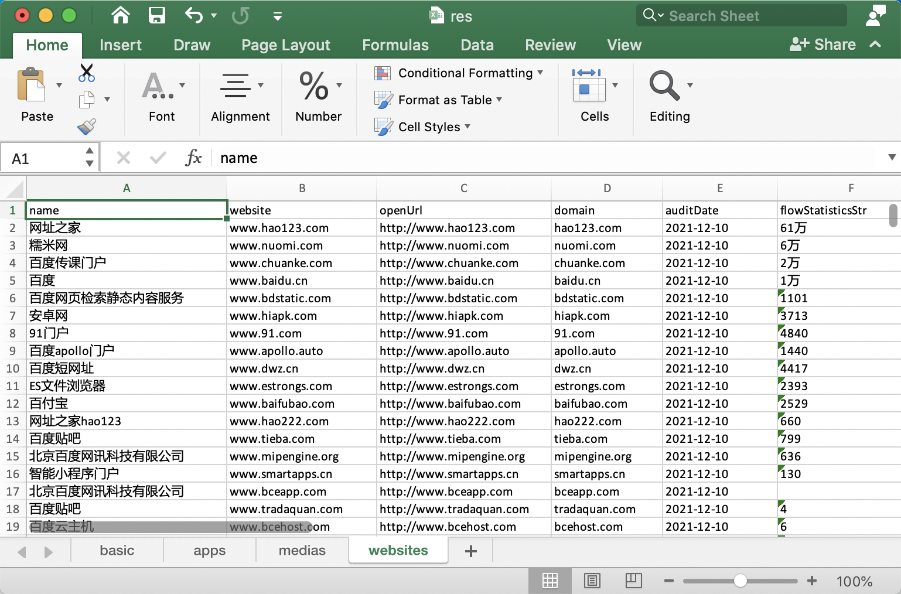

## lbb


### 简介

lbb是一个企业信息查询工具，可以帮助企业查询自身对外公开的应用、新媒体，网站等。

[小蓝本](https://xiaolanben.com/)用于查询企业信息及新媒体【含公众号、小程序、快手、抖音、微博】、app、注册网站等。


### 配置

登录小蓝本获取cookie中的userId、token字段值，配置conf.yaml。

经测试会话有效期为一周。

```yaml
browser_path: 'C:\Program Files\Google\Chrome\Application\chrome.exe' # 浏览器的路径
headless: false # 设置false显式运行浏览器 true则反之
timeout_ms: 20000 # 浏览器中操作超时时间
timeinterval_ms: 500 #  浏览器中操作的间隔时间
token: '' # 登录后cookie中的token字段值
uid: '' # 登录后cookie中的userId字段值
```


### 使用

```shell
C:\Users\lbb>lbb_win.exe
Usage of lbb_win.exe:
  -c string
        config file	# 指定配置文件
  -e string
        company eid	# 选择公司eid
  -o string
        output to xlsx file	# 存储文件名
  -p string
        proxy	# 设置代理请求
  -q string
        company name	# 查询公司名称
```


查询公司名称

```shell
C:\Users\lbb>lbb_win.exe -c conf.yaml -q 百度
+----------+--------------------------------------+------------------------------------+
|   name   |               company                |                eid                 |
+----------+--------------------------------------+------------------------------------+
| 百度在线 |   百度在线网络技术（北京）有限公司   | qdf8efa4a590e739bde900d4191ee136a  |
| 百度网讯 |       北京百度网讯科技有限公司       | q3b6b8c0fe6d2e4c2ace66a5e58e17f56  |
| 百度控股 |           百度控股有限公司           | qo1facf3a9b2f6082715f771a040243bce |
| 小度互娱 |       北京小度互娱科技有限公司       | q7b1edcf4776ca4445664f40db61a47a3  |
| 达孜县百 | 达孜县百瑞翔创业投资管理有限责任公司 | q8adbc28bc9b34b6291b659d70a2bafbb  |
| 度小满小 |      重庆度小满小额贷款有限公司      | qe31c7f494e5ef445a055d26decd5af46  |
| 糯米网科 |      北京糯米网科技发展有限公司      | qd0e5589eed347dbab9f3126257cb8fec  |
| 百度移信 |   百度移信网络技术（北京）有限公司   | q66daf49d6b0c81f9e1a7a00f8d5a2b05  |
| 百度移讯 |       北京百度移讯科技有限公司       | qe6ba842062b77aedeb6ce62b5eacd8d2  |
| 度小满支 |      北京度小满支付科技有限公司      | q565a57b148e69f0269c0a8f75b7d878e  |
| 百度博瑞 |     福建百度博瑞网络科技有限公司     | qec7ec7c5bd914321b103f12ce6d04190  |
| 百度时代 |   百度时代网络技术（北京）有限公司   | q85b1e3a2244294ce6553d2b731763c20  |
|  百度中  |         百度（中国）有限公司         | q74ac0016ba70f3e6261c77487d7f0ae3  |
| 传课计算 |    传课计算机系统（北京）有限公司    | q4bd71cae6530434af804f72c8dcdbd89  |
+----------+--------------------------------------+------------------------------------+
```


指定公司eid查询

```shell
C:\Users\lbb>lbb_win.exe -c conf.yaml -e q3b6b8c0fe6d2e4c2ace66a5e58e17f56 -o res.xlsx
2022/02/07 09:57:16 apps: 1077, medias: 123, website: 266
2022/02/07 09:57:16 apps: \
 1077 / 1077 [============================================================================================] 100.00% 43s
2022/02/07 09:58:00 medias: \
 123 / 123 [===============================================================================================] 100.00% 2s
2022/02/07 09:58:02 websites: \
 266 / 266 [===============================================================================================] 100.00% 4s
2022/02/07 09:58:07 saved to res.xlsx
```


### 结果展示









### 下载
https://github.com/PoJun-Lab/lbb/releases

### 交流群加入


